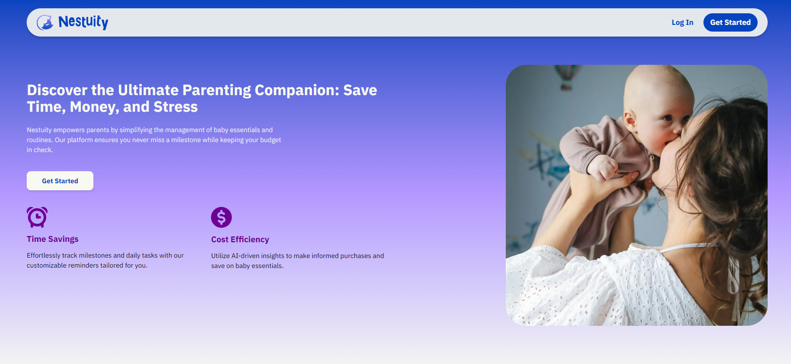

# Home

## About Nestuity
Nestuity supports parents of newborns by simplifying the management of daily essentials. The app reduces the need for multiple tools, eases financial strain, and offers peace of mind through smart pricing insights, cost tracking for essential items, a usage calculator to forecast diaper needs, and intelligent reminders for supplies and key milestones.

### Core Functionalities
- Usage Calculator: Predicts baby essential needs based on the baby's age and consumption patterns
- Smart Analysis and Price Prediction: Monitor and analyze price trends across major retailers so parents can buy at the most optimal time
- Intelligent Reminders: Monitors both developmental milestones and essential care tasks. 
- User Profile Management: Allow parents to create an account to store personal information and manage individual preferences in a centralized system
- Notification Management: Allow parents to customize the type, frequency, and method of reminders. 

### Target Users
Nestuity is geared towards young parents with newborn children, looking to ease the mental load of caring for and raising a baby while maintaining a career and personal life. 
