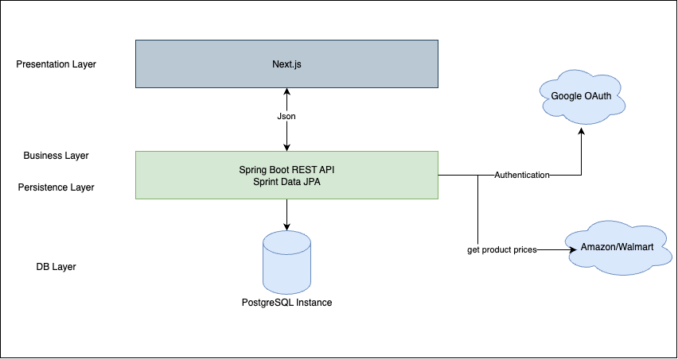
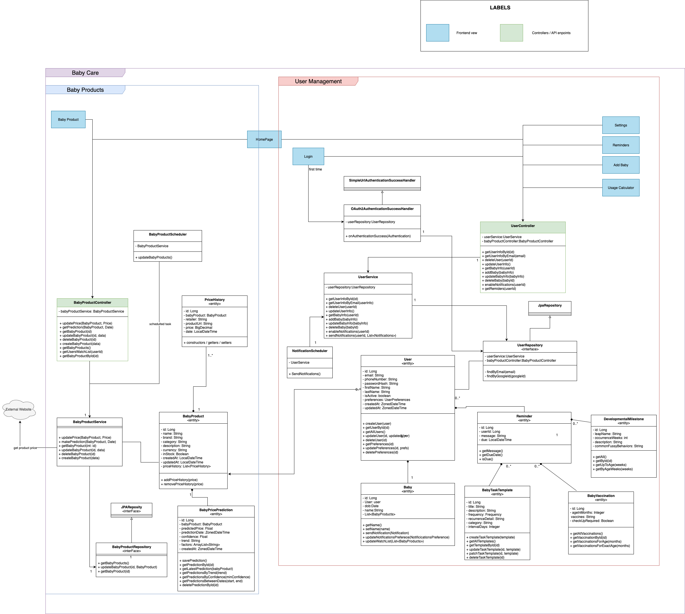
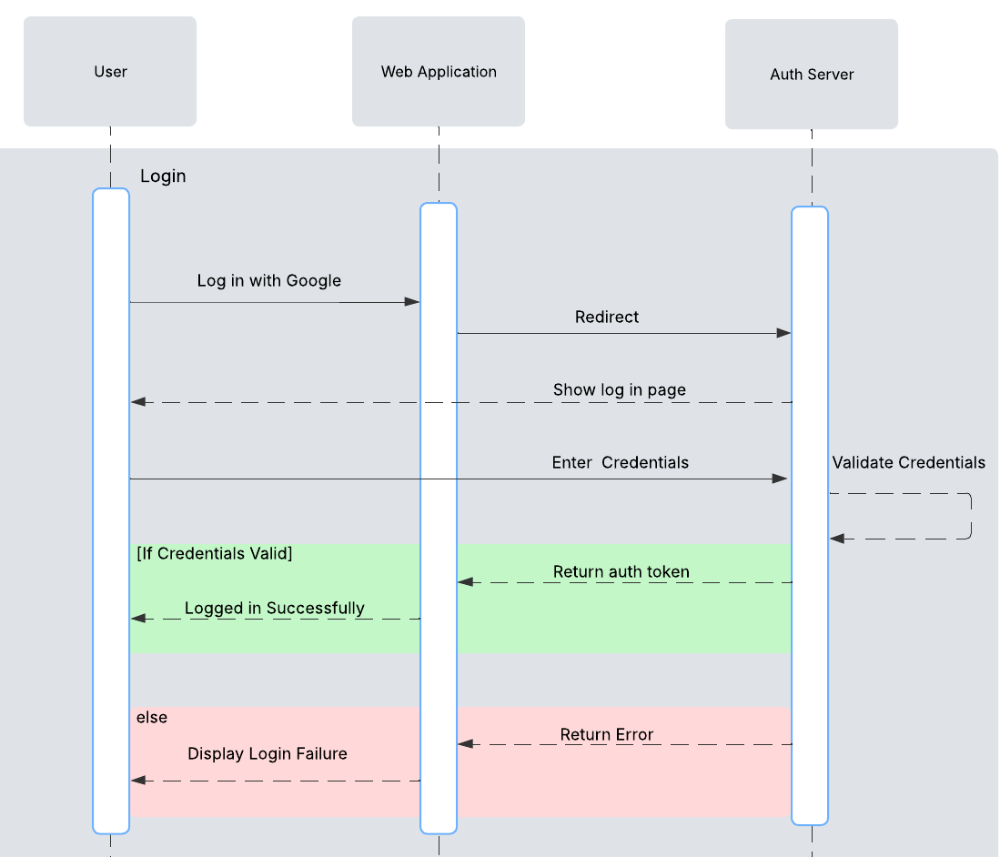
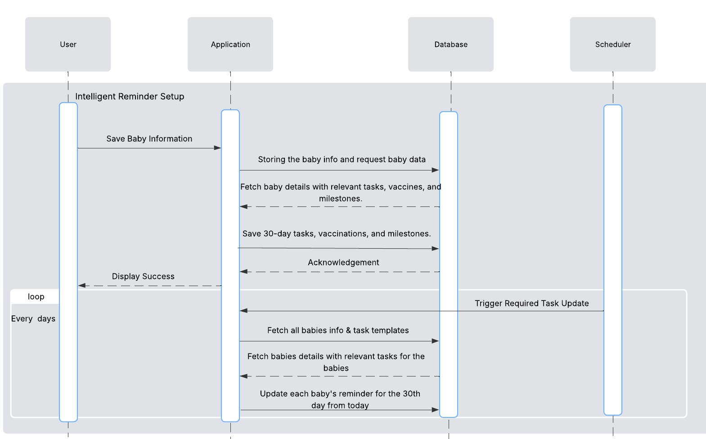
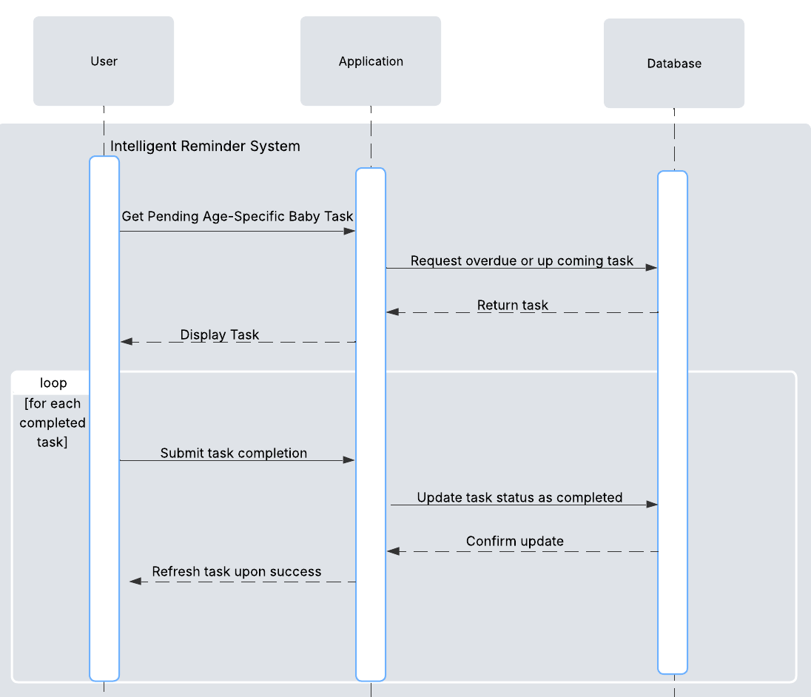
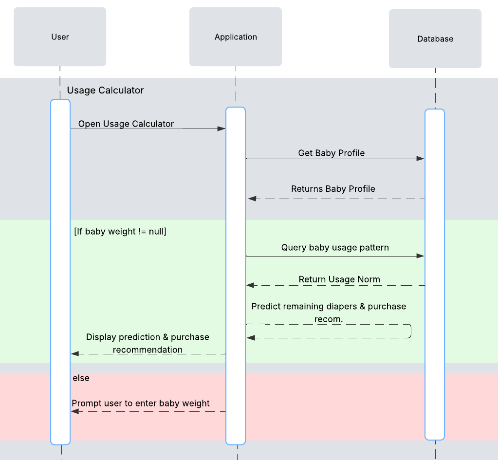
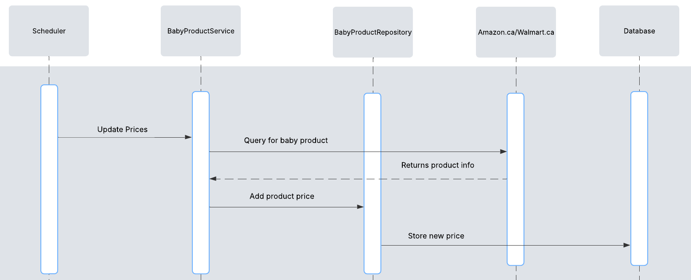
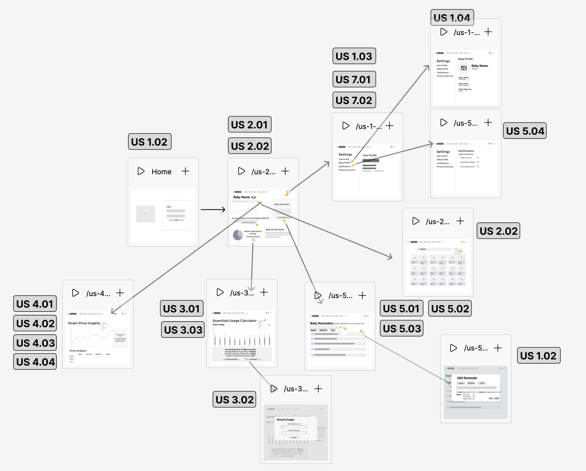

# Software Design

## High Level Architecture Diagram

## Client/Server Architecture

## Technologies
Frontend: Next.js 
- https://nextjs.org/docs
- https://tailwindcss.com/docs/installation/framework-guides/nextjs

Backend: Spring Boot
- https://spring.io/guides/gs/rest-service

Database: PostgreSQL
- https://www.postgresql.org/docs/

Deployment: Docker + NGNIX + Cybera
- https://nginx.org/
- https://docs.docker.com/

## UML 

---

## Sequence Diagrams

### Log In
***Scenario:*** The user attempts to log in to the web application using Google. The application redirects the user to the authentication server (e.g., Google OAuth). The authentication server displays the login page, where the user enters their credentials. The server validates the credentials: if they are valid, the authentication server issues an authorization token and redirects the user back to the web application. The application receives the token, establishes a session, and displays a successful login state to the user. If the credentials are invalid, the authentication server does not issue a token and instead returns an error, prompting the user to retry.

### Notifications
***Scenario:*** A scheduler, implemented using Spring Boot’s @Scheduled annotation, automatically triggers a nightly reminder check. During this process, the application retrieves each user’s notification preferences along with their last refill record from the database. For each user, if the stock level is below the defined threshold and notifications are enabled, the application sends a reminder through the user’s preferred communication channel(s).

### Intelligent Reminder Setup
***Scenario:*** When a new baby profile is created, the user enters and saves the baby’s information through the application, which stores the data in the database and immediately retrieves and saves all relevant vaccination schedules and developmental milestones for the baby. At the same time, the application also fetches the tasks for the upcoming 30 days to initialize the baby’s reminder setup. Once this process is complete, the system displays a confirmation message indicating that the baby’s profile and reminders have been successfully created. In the background, a scheduler runs automatically every day, fetching all baby profiles and task templates from the database. For each baby, it identifies which tasks are due exactly 30 days from the current date and updates or creates reminders for that specific day, ensuring that as each day passes, the system continuously maintains accurate and timely reminders.

### Intelligent Reminder System
***Scenario:*** The user opens the reminder screen, and the application retrieves all age-specific incomplete tasks from the database for the baby. These reminders are displayed to the user, who can mark the ones they have completed. As tasks are marked complete, the application updates their status in the database. Once the update is confirmed, the application refreshes the task list and reflects the changes, ensuring that reminders remain accurate and up to date.

### Usage Calculator
***Scenario:*** When the user opens the Usage Calculator, the application retrieves the saved baby profile from the database. If the profile includes the baby's weight, the system queries the database for the corresponding usage norms based on the baby’s stats. Using these norms, the application predicts the remaining diaper supply and recommends the number of diapers to purchase, then displays the results to the user. If the baby profile is missing the weight, the system does not retrieve the norms or perform the calculation. Instead, it prompts the user to enter the baby’s weight.

### Baby Essential Pricing Flow
***Scenario:*** In the system, a scheduler implemented with Spring Boot’s @Scheduled annotation automatically triggers the service responsible for updating baby product prices each night. This service contacts external retail sources API’s, such as Amazon.ca and Walmart.ca, to request the most recent pricing information. Once the data is retrieved, it is processed and passed through the application’s repository layer, which updates the underlying database with the new prices. 

## Low Fidelity Diagram
