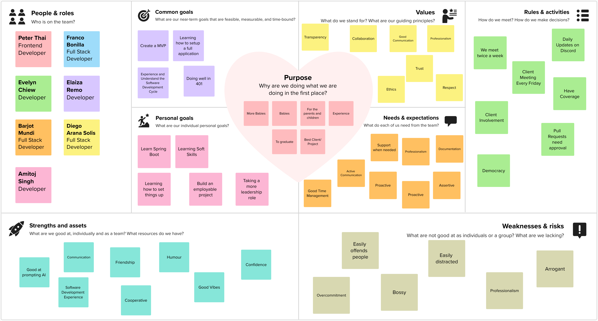

# Teamwork

## Team Canvas

## Belbin Roles

| Name                | Preferred Roles      | Manageable Roles | Least Preferred Roles |
|--------------------|:-------------------:|:----------------:|:--------------------:|
| Peter Thai          | SH, IMP, CF        | PL, ME, RI     | TW, SP, CO         |
| Franco Bonilla      | IMP, PL, SH        | TW, SP, CF     | RI, CO, ME         |
| Evelyn Chiew        | CF, IMP, SH        | SP, RI, TW     | ME, CO, PL         |
| Elaiza Remo         | TW, IMP, SP        | SH, RI, CF     | CO, PL, ME         |
| Barjot Mundi        | TW, CO, SH         | PL, CF, SP     | IMP, ME, RI        |
| Diego Arana Solis   | SP, IMP, CF        | CF, PL, ME     | RI, CO, TW         |
| Amitoj Singh        | CF, TW, CO         | PL, CF, CO     | SP, SH, RI         |

### Thinking Roles

#### PL (Plant)
>
> Tends to be highly creative and good at solving problems in unconventional ways.  

- **Preferred:** Franco Bonilla  
- **Manageable:** Peter Thai

#### ME (Monitor Evaluator)
>
> Provides a logical eye, making impartial judgements where required and weighs up the team's options in a dispassionate way.  

- **Manageable:** Peter Thai, Diego Arana Solis

#### SP (Specialist)
>
> Brings in-depth knowledge of a key area to the team.  

- **Preferred:** Elaiza Remo, Diego Arana Solis  

---

### Action Roles

#### SH (Shaper)
>
> Provides the necessary drive to ensure that the team keeps moving and does not lose focus or momentum.  

- **Preferred:** Franco Bonilla, Evelyn Chiew  

#### IMP (Implementer)
>
> Needed to plan a workable strategy and carry it out as efficiently as possible.  

- **Preferred:** Peter Thai, Elaiza Remo  

#### CF (Completer Finisher)
>
> Most effectively used at the end of tasks to polish and scrutinize the work for errors, subjecting it to the highest standards of quality control.

- **Preferred:** Evelyn Chiew, Diego Arana Solis  

---

### People Roles

#### RI (Resource Investigator)
>
> Uses their inquisitive nature to find ideas to bring back to the team.  

- **Manageable:** Evelyn Chiew, Elaiza Remo

#### TW (Teamworker)
>
> Helps the team to gel, using their versatility to identify the work required and complete it on behalf of the team.  

- **Preferred:** Barjot Mundi, Amitoj Singh  

#### CO (Co-ordinator)
>
> Needed to focus on the team's objectives, draw out team members and delegate work appropriately.  

- **Preferred:** Barjot Mundi, Amitoj Singh  

## Scrum Roles

### Sprint 1

- **SCRUM Master:** Peter Thai  
- **Product Owner:** Franco Bonilla  

### Sprint 2

- **SCRUM Master:**  Diego Arana
- **Product Owner:** Franco Bonilla

### Sprint 3

- **SCRUM Master:**  Barjot Mundi
- **Product Owner:**  Franco Bonilla

### Sprint 4

- **SCRUM Master:**  Franco Bonilla
- **Product Owner:**  Franco Bonilla

### Sprint 5

- **SCRUM Master:**  Elaiza Remo
- **Product Owner:**  Franco Bonilla

