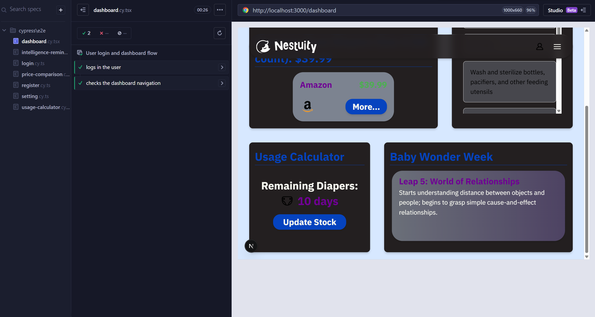
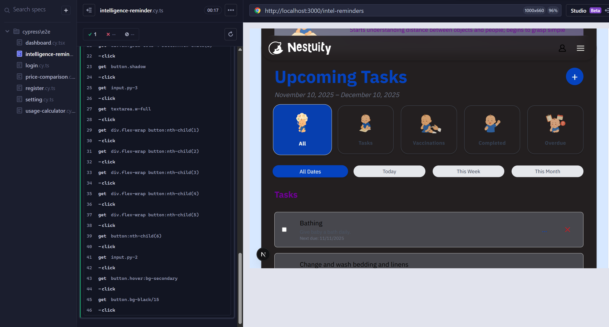
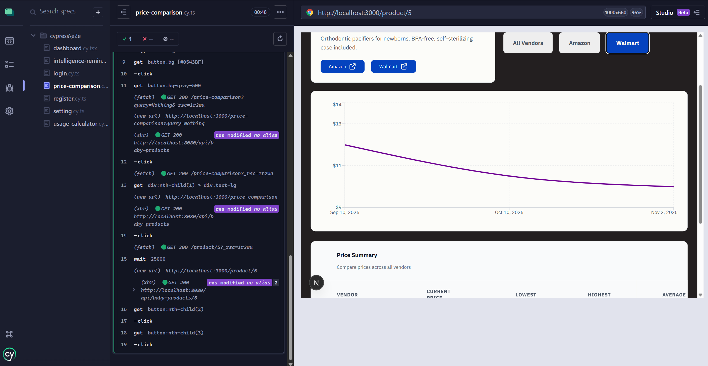
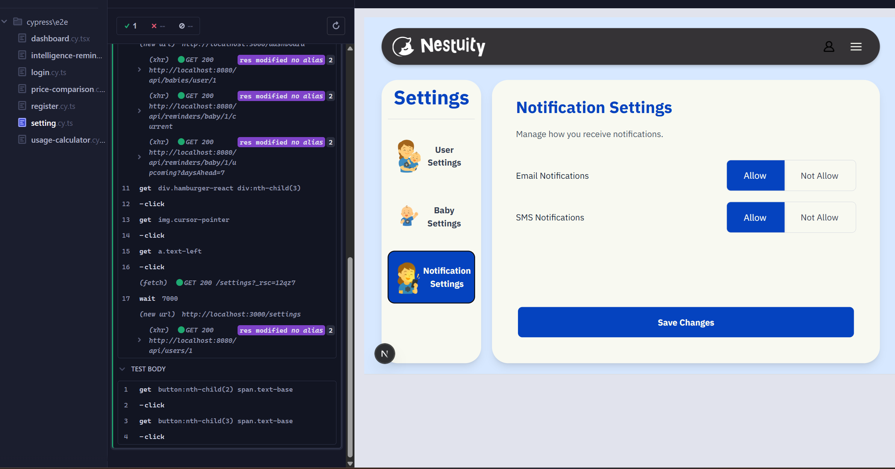
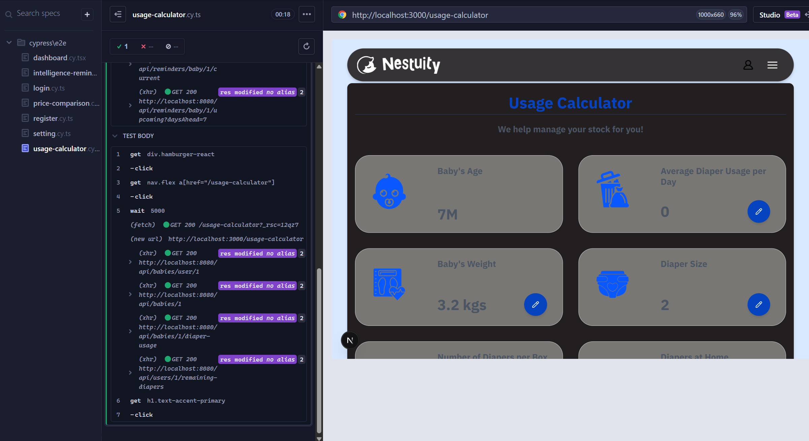

## Running Tests Locally

You can run all tests locally using Cypress with the following command:

```bash
npx cypress open
````

This will launch the **Cypress Test Runner**, allowing you to interactively run all test suites.

> **Note:**
> To speed up the PR process, some tests have been temporarily commented out. These tests are dynamic in nature and can be re-enabled locally to achieve full test coverage.

---

## Recent Test Run Screenshots

Below are screenshots from recent test runs, stored in the `cypress-test-result` folder:

| Dashboard                                           | Intelligence Reminder                                                       |
| --------------------------------------------------- | --------------------------------------------------------------------------- |
|  |  |

| Price Comparison                                                  | Setting                                         |
| ----------------------------------------------------------------- | ----------------------------------------------- |
|  |  |

| Usage Calculator                                                  |
| ----------------------------------------------------------------- |
|  |

